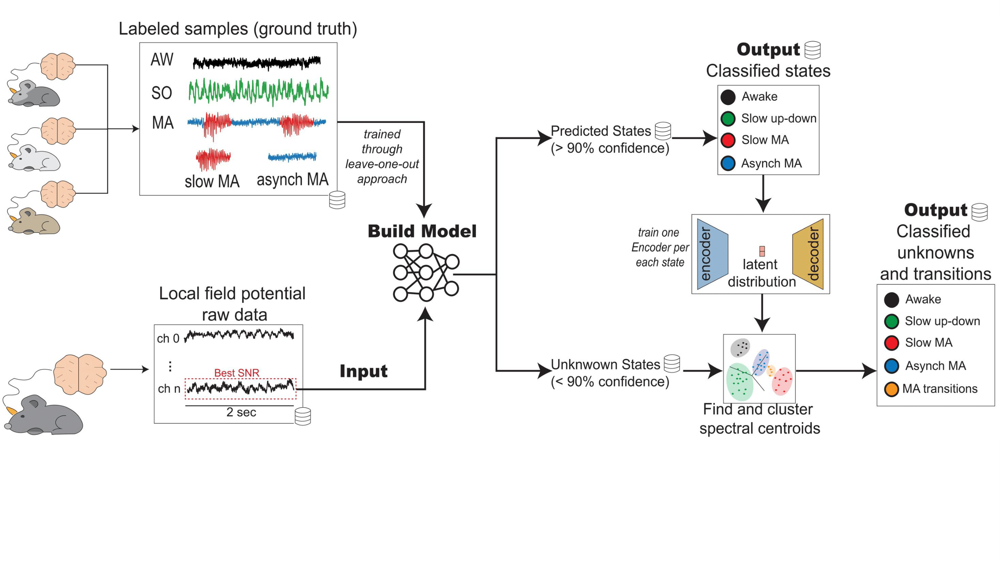

# Neural models for anesthesia stage transition detection and classification

This repository contains code for the detection and classification of anesthesia-induced brain state transitions, including wakefulness, slow oscillations, and microarousals. We leverage a dual-model Convolutional Neural Network (CNN) and a self-supervised autoencoder-based multimodal clustering algorithm to achieve accurate brain state classification and transition detection based on in vivo LFP recordings from rats.

## Overview
The pipeline processes the data through a series of steps, including preprocessing, state classification, and transition detection, using a combination of supervised and self-supervised learning techniques. It achieves accuracy rates of up to 96% for specific states and averages over 85% across all states, with 74% accuracy for detecting transitions. The methodology employs a leave-one-out strategy for model training, ensuring broad applicability across subjects.



## Usage
For classification, check the example notebook located at `example_notebook/general_notebook.ipynb`. For transition detection, refer to the notebook at `example_notebook/transition_notebook.ipynb`. For further understanding and visualization of the process during the Autoencoders phase, please check and follow the comments in the example notebooks located at `example_notebook/clusters_psd_notebook.ipynb` and `example_notebook/autoencoders_synthetic.ipynb`.

Make sure to follow the instructions in the notebooks to properly preprocess your data, train the models, and perform the classification and transition detection tasks.

## Citations
If you find this repository useful for your research, please consider citing our work:

**Arnau Marin-Llobet, Arnau Manasanch, Leonardo Dalla Porta, and Maria V. Sanchez-Vives.**  
*"Deep neural networks for detection and classification of brain states."*  
*Journal of Sleep Research, vol. 33, Wiley, 2024.*

```bibtex
@article{marin2024deep,
  title={Deep neural networks for detection and classification of brain states},
  author={Marin-Llobet, Arnau and Manasanch, Arnau and Dalla Porta, Leonardo and Sanchez-Vives, Maria V},
  journal={Journal of Sleep Research},
  volume={33},
  year={2024},
  publisher={Wiley}
}
```

## Issues
For any questions or issues, feel free to raise an issue on this GitHub repository, and we will do our best! 
